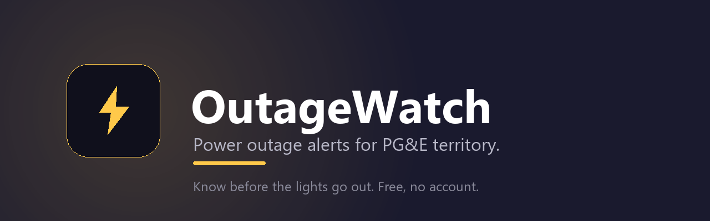
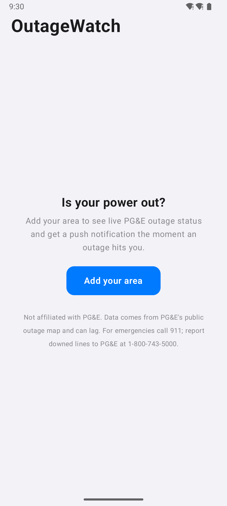
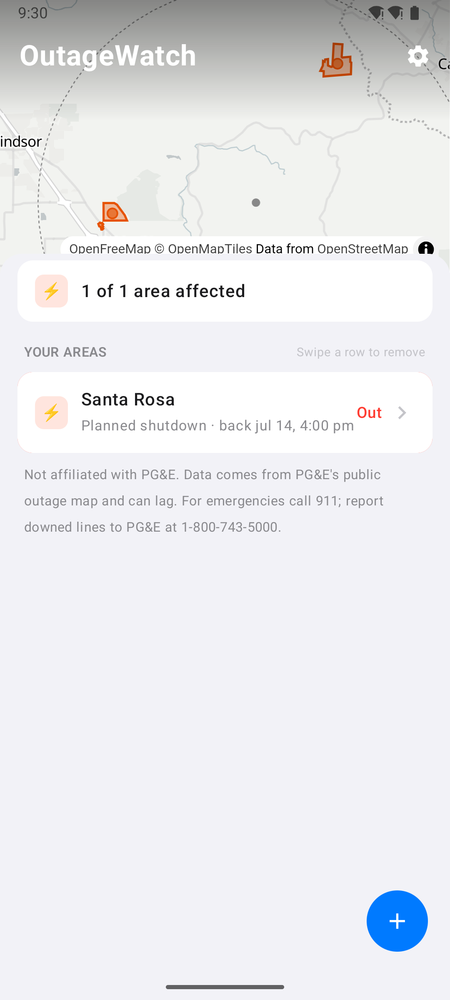
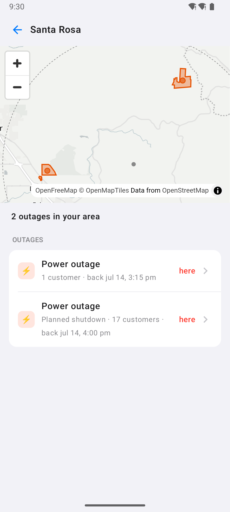
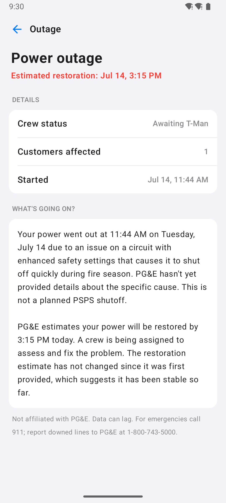
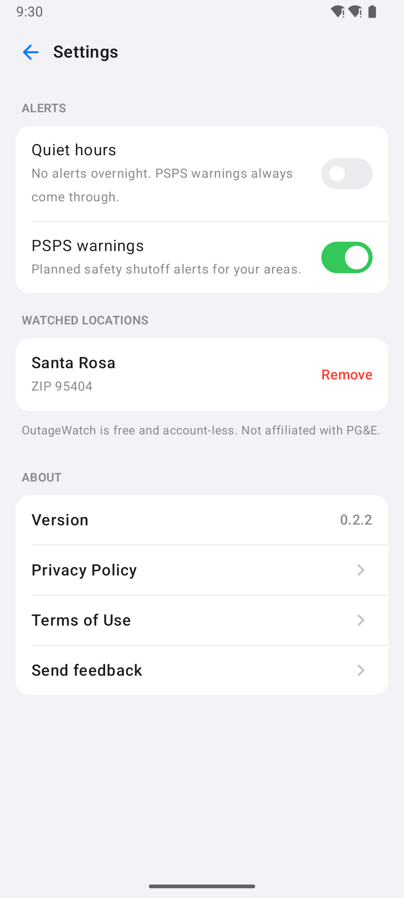
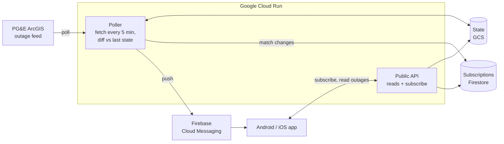

<div align="center">



<br>

**Know before the lights go out.** Push alerts, restoration times, and plain-language answers for power outages in PG&amp;E territory. Free, no account.

[](https://github.com/nicglazkov/outagewatch/releases/latest)
[](https://github.com/nicglazkov/outagewatch/actions/workflows/ci.yml)
[](https://github.com/nicglazkov/outagewatch/releases)
[](LICENSE)


</div>

---

## Download

<div align="center">

[](https://github.com/nicglazkov/outagewatch/releases/latest)
&nbsp;

&nbsp;


</div>

**Android, right now:** grab the latest `OutageWatch-x.y.z.apk` from the [**Releases**](https://github.com/nicglazkov/outagewatch/releases/latest) page and open it on your phone. You may need to allow "install from this source" when your browser or files app asks. It updates in place over older versions.

**iOS and the app stores:** native App Store and Google Play listings are planned for **August 2026**. Until then, the Android APK above is the way in.

---

## Screenshots

<table>
  <tr>
    <td align="center"><br><sub><b>Add an area</b></sub></td>
    <td align="center"><br><sub><b>Your areas at a glance</b></sub></td>
    <td align="center"><br><sub><b>Outages near you</b></sub></td>
    <td align="center"><br><sub><b>Plain-language answer</b></sub></td>
    <td align="center"><br><sub><b>Quiet hours &amp; more</b></sub></td>
  </tr>
</table>

---

## What it does

Pick your ZIP code or a precise address, and OutageWatch watches PG&amp;E's public outage map for you.

- ⚡ **Push the moment it matters.** A notification when an outage starts at your location, when the restoration estimate moves, when power is back, and when a PSPS safety shutoff is coming.
- 🗺️ **See it on a map.** Your watched areas, live outage footprints, restoration estimates, and how many customers are affected.
- 🤖 **Plain-language answers.** Every outage has a short "what's going on and when is it coming back" written from the real feed data, not marketing copy.
- 🌙 **Quiet hours.** No overnight buzzing, except a planned-safety-shutoff warning, which always comes through.
- 🔒 **No account, no sign-up, no ads.** Your saved areas stay on your device.

### Only four things ever notify you

An outage **started** at your location, the restoration estimate **moved** by more than 30 minutes, power was **restored**, or a **PSPS warning** covers your area. Quiet hours are respected for everything except PSPS. Nothing else, ever.

### The explanation card

Outage detail includes a short, calm answer to "why is my power out and when is it coming back," rendered by Claude Haiku from the structured feed data only. The model is not allowed to invent restoration times or causes, and responses are cached per outage update so it stays fast and cheap.

---

## How it works



A **poller** on Cloud Run reads PG&amp;E's feed every five minutes, diffs it against the previous snapshot, matches changes to saved areas, and sends pushes through FCM. A separate **public API** serves reads and subscriptions to the apps and to a small web status page at `/`. Devices never poll PG&amp;E directly. Raw snapshots are recorded so a real outage day becomes a regression fixture.

---

## Tech stack

| Layer | Built with |
|---|---|
| **App** | Kotlin, Compose Multiplatform (one shared UI for Android + iOS), MapLibre |
| **Backend** | Python 3.12, FastAPI, `uv`, deployed to Google Cloud Run |
| **Data** | Firestore (subscriptions), Cloud Storage (feed state), Firebase Cloud Messaging |
| **AI** | Claude Haiku for the explanation card |
| **Sources** | PG&amp;E public ArcGIS outage services, US Census ZCTA gazetteer |

---

## Development

**Backend**

```bash
cd backend
uv sync --extra server
uv run ruff check .
uv run pytest
uv run python scripts/dev_server.py   # local API with fixture data on :8787
```

**Android**

```bash
cd mobile
./gradlew :shared:testAndroidHostTest
./gradlew :androidApp:assembleDebug
```

Firebase config for push goes in `mobile/local.properties` (see `androidApp/build.gradle.kts`). Debug builds work without it; push is simply skipped. iOS builds from `mobile/iosApp` in Xcode on a Mac.

See [CONTRIBUTING.md](CONTRIBUTING.md) for the full setup and PR flow.

---

## Privacy

OutageWatch has no accounts and collects no analytics. Your saved areas and a push token live on your device and in the backend only to deliver alerts. Full details in the [Privacy Policy](PRIVACY.md) and [Terms of Use](TERMS.md).

---

## Contributing &amp; support

- 🐛 Found a bug or have an idea? [Open an issue](https://github.com/nicglazkov/outagewatch/issues).
- 🔒 Security report? See [SECURITY.md](SECURITY.md).
- 🤝 Want to help? [CONTRIBUTING.md](CONTRIBUTING.md) and the [Code of Conduct](CODE_OF_CONDUCT.md).

---

## Disclaimer

**Not affiliated with PG&amp;E.** Data comes from PG&amp;E's public outage map and can lag behind reality. Do not rely on OutageWatch for safety-critical decisions. **For emergencies call 911.** Report downed power lines to PG&amp;E at **1-800-743-5000**.

## License

[MIT](LICENSE) © Nic Glazkov
